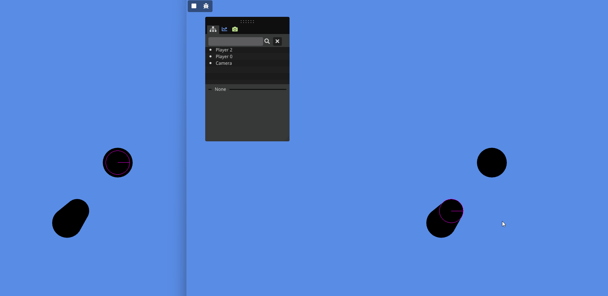
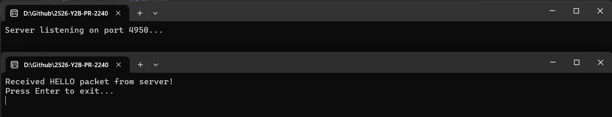

## My project


This is an eight-week school project where we could choose our own research topic related to game technologies. I chose to focus on networking, starting from a custom engine provided by school that does not have any networking built in.

My goal is to extend the engine with a networking system that makes it possible to create multiplayer games, while also keeping the system reusable so it can be included in different types of projects, not only games. On top of that, I want to build a synchronization and prediction system to support fast-paced multiplayer gameplay. Finally, I will create a small game to demonstrate all three systems working together. In this blog, I will explain how I built the networking layer, how synchronization and client-side prediction work on top of it, and how these systems are used together in the final multiplayer game prototype.

## Context
Multiplayer is a big part of many games, but it requires keeping multiple players synchronized while dealing with network delay and packet loss.

The engine used for this project did not have a networking system, which made it a good base to implement networking from scratch as a learning project.

For this project, I built a custom UDP networking layer with my own packet format, and on top of that a snapshot-based synchronization system with client-side prediction to keep gameplay responsive while the server stays authoritative.

To follow the technical parts, readers should have basic programming knowledge.
Low-level socket concepts are not explained in detail here; for that I recommend Beej’s Guide to Network Programming[1]. This section focuses on how my networking lib is used.


### Networking
#### Client
The networking layer exposes a simple API: application code only queues RawPackets to send, calls Update(dt) each frame, and reads received packets from a list. All socket handling, send timing, validation, and optional encryption are handled inside the networking module. Both the client and server use the same packet format and queue-based sending system, which keeps the application code independent from low-level networking details.

 ```cpp
int main()
{
    using clock = std::chrono::steady_clock;
    auto lastTime = clock::now();

    NetworkClient client;

    // 1) Queue a packet to send (game code never calls sendto directly)
    RawPacket pkt{};
    pkt.header.type = PKT_HELLO;
    client.m_dataList.toSend.push_back(pkt);

    // 2) Run networking in the main loop
    bool msg = false;
    while (!msg)
    {
        auto now = clock::now();
        float dt = std::chrono::duration<float>(now - lastTime).count();
        lastTime = now;

        // Update() handles sending + receiving internally
        client.Update(dt);

        // 3) Read received packets from a list
        for (const RawPacket& rcvPkt : client.m_receivedData.PKTReceived)
        {
            if (rcvPkt.header.type == PKT_HELLO)
            {
                msg = true;
                printf("Received HELLO packet from server!\n");
            }
        }

        Sleep(100);
    }

    std::cout << "Press Enter to exit...\n";
    std::cin.get();
}
 ```



#### Server
On the server, networking is handled in a simple loop. The server polls for new packets, and each packet type can be handled in a switch statement. This makes it easy to add custom behavior per message.
 
 ```cpp
while (true)
{
    // Delta time
    auto now = clock::now();
    float dt = std::chrono::duration<float>(now - lastTime).count();
    lastTime = now;

    // Receive incoming packets
    netServer.Poll();

    // Handle packets
    for (auto& packet : netServer.Received)
    {
        switch (packet.pkt.header.type)
        {
        case PKT_HELLO:
        {
            RawPacket reply{};
            reply.header.type = PKT_HELLO;

            // Queue response to sender
            netServer.toSend.push_back({ reply, packet.from, packet.fromLen });
            break;
        }
        default:
            break;
        }
    }

    netServer.Received.clear();

    // Send all queued packets
    netServer.FlushSends();
}
 ```


### Syncronization
The server is authoritative and updates the game state using the inputs it receives from clients.
To keep all clients in sync, the server regularly sends snapshots containing the current authoritative state.

Inputs are stored per player and only applied when the expected tick is available. This keeps the simulation deterministic and in order. Older inputs are ignored to prevent the history buffer from growing indefinitely and to avoid replaying outdated commands.

 ```cpp
 void GameServer::OnInput(uint32_t playerId, const InputCmd& cmd)
{
    auto it = players.find(playerId);
    if (it == players.end()) return;

    PlayerState& p = it->second;

    // first input sets baseline
    if (!p.hasBaseline)
    {
        p.hasBaseline = true;
        p.nextExpectedTick = cmd.tick;
        p.lastProcessedInputTick = cmd.tick - 1;
    }

    // drop very old inputs
    if (cmd.tick + HISTORY < p.nextExpectedTick) return;

    p.pending[cmd.tick] = cmd;
}
  ```

In the server update loop, the input for the current expected tick is applied.
If that input has not arrived yet, the server simply waits and does not advance the simulation for that player.
This keeps the server simulation deterministic and ensures that inputs are processed in the same order they were sent.

```cpp
    auto inp = player.pending.find(player.nextExpectedTick);
    if (inp == player.pending.end())
    {
        continue;
    }

    InputCmd cmdToUse = inp->second;

    // apply movement and actions here using the authoritative game logic

    player.lastProcessedInputTick = player.nextExpectedTick;
    player.nextExpectedTick++;
  ```

When a snapshot is sent, the server builds a packet with the state that clients need to synchronize.
What exactly goes into the snapshot depends on the project (for example position, velocity, health, etc.).
 ```cpp
 SnapshotPacket snap{};
snap.serverTick = tick;
snap.count = 0;

for (auto& [id, st] : players)
{
    if (snap.count >= MAX_PLAYERS) break;

    SnapshotPlayer sp{};
    sp.id = id;
    sp.lastProcessedInputTick = st.lastProcessedInputTick;

    // fill in authoritative state to sync
    // (position, velocity, game state, etc.)

    snap.players[snap.count++] = sp;
}

// pack and send snapshot to all clients
for (auto& [id, addr] : clientAddrs)
    netServer->toSend.push_back({ pkt, addr, sizeof(sockaddr_in) });
 ```

### Prediction
I use this prediction system in the Bee engine, so it’s wired into Bee’s ECS, input, and physics. Things like input handling, shooting, and movement are game-specific and will change per project. But the core prediction logic (fixed ticks, input/state history, server ack with lastProcessedInputTick, and correcting + replaying inputs) is engine-independent. So it’s not drag-and-drop for every engine, but it’s a good base for any snapshot-based multiplayer game.

The fixed tick simulation and the input/state history can be reused in other snapshot-based projects with very few changes.
```cpp
while (tickAccumulator >= TICK_DT)
{
    uint32_t t = player.localTick;

    InputCmd cmd = BuildInputCmd(t);
    hist.inputs[t % HISTORY] = cmd;

    // send input to server
    RawPacket pkt{};
    pkt.header.type = PKT_INPUT;
    pkt.payload.resize(sizeof(InputCmd));
    std::memcpy(pkt.payload.data(), &cmd, sizeof(InputCmd));
    networkClient.m_dataList.toSend.push_back(std::move(pkt));

    // local prediction
    SimulateOneTick(player, cmd);
    hist.states[t % HISTORY] = { t, player.pos, player.vel };

    player.localTick++;
    tickAccumulator -= TICK_DT;
}
```


The compare/correct/replay step is also generic. Only what you compare (position, rotation, extra state) depends on the game
To keep prediction stable, I use a small error threshold (POS_EPS) so tiny differences do not cause constant corrections. The server tick (lastProcessedInputTick) is used to compare the server state with the exact predicted tick on the client. I also validate the history buffer using the stored tick value so outdated or missing prediction data is never replayed.
```cpp
uint32_t t = sp.lastProcessedInputTick;

const PredictedState& predicted = hist.states[t % HISTORY];
if (predicted.tick != t) return;

glm::vec3 serverPos(sp.posX, sp.posY, sp.posZ);
float posError = glm::length(serverPos - predicted.pos);

const float POS_EPS = 0.05f;
if (posError <= POS_EPS) return;

// correct to server state
player.pos = serverPos;
player.vel = glm::vec3(sp.velX, sp.velY, sp.velZ);

// replay inputs
for (uint32_t rt = t + 1; rt < player.localTick; rt++)
{
    const InputCmd& cmd = hist.inputs[rt % HISTORY];
    SimulateOneTick(player, cmd);
    hist.states[rt % HISTORY] = { rt, player.pos, player.vel };
}
```
## Result
To check performance, I used the Visual Studio 2022 CPU profiler on both the client and the server while the game was running and connected.

#### Memory usage
I did not see noticeable memory growth during gameplay. Packet buffers and snapshot data are reused each frame, so no large allocations happen continuously during runtime.

#### Frame times
Client profiling showed that most frame time is spent on rendering and ImGui, while networking, prediction, and snapshot handling only take a very small part of the total frame time. This means the networking system is not a CPU bottleneck on the client in the tested scenario.

#### Visual comparison (before / after networking)
Visually, the game behaves the same with and without networking enabled, except that with networking active the player movement is smoothed using prediction and reconciliation. No visible frame drops were observed when connecting to the server.

#### Trade-offs
I chose a snapshot + prediction model instead of full state sync because it gives better responsiveness for a shooter, at the cost of more complex client logic and extra bandwidth. I also chose to keep encryption enabled on all packets, which adds a small CPU cost but improves security and makes the networking layer more reusable for other projects.

## Conclusion
I learned how multiplayer games rely on server authority, snapshots, and prediction instead of just syncing positions. Implementing prediction and reconciliation showed me why input history and server acknowledgements are so important.

I expected gameplay to go fast, but once it became multiplayer, almost every feature needed extra work for prediction and server validation. This made it clear that most of the complexity in multiplayer games is in synchronization, not in the gameplay itself.

If I started again, I would standardize the networking and packet handling earlier. At first, packet logic was mixed into send and receive code, which caused constant changes. After moving this into a proper networking module, adding new packet types and sending data became much easier.

In the future, I would add better packet loss handling by sending multiple recent inputs per packet, so the server can recover from dropped packets. I would also improve security further, for example by adding more validation and protection against invalid or spoofed packets.

## sources
[1]B. Hall, “Beej’s Guide to Network Programming,” beej.us. [Online]. Available: https://beej.us/guide/bgnet/html/split/intro.tml#audience. 
Accessed: Nov. 29, 2025.

[2] GDC Vault, “Overwatch: Gameplay Architecture and Netcode,” Game Developers Conference. [Online]. Available: https://www.gdcvault.com/play/1024001/-Overwatch-Gameplay-Architecture-and
. Accessed: Nov. 29, 2025.